**Les codes de chiffrement par subsitution polyalphabétique dans les
chasses de Max**

**V1.0 Juillet 2024**

# Table des matières {#table-des-matières .TOC-Heading}

[Rappels [2](#rappels)](#rappels)

[Chiffrement par substitution simple
[2](#chiffrement-par-substitution-simple)](#chiffrement-par-substitution-simple)

[Chiffrement Vigenère : substitution par position
[2](#chiffrement-vigenère-substitution-par-position)](#chiffrement-vigenère-substitution-par-position)

[Exemples de chiffrements polyalphabétiques dans les chasses de Max
[3](#exemples-de-chiffrements-polyalphabétiques-dans-les-chasses-de-max)](#exemples-de-chiffrements-polyalphabétiques-dans-les-chasses-de-max)

[Le testament de Florence B (décembre 1996)
[3](#le-testament-de-florence-b-décembre-1996)](#le-testament-de-florence-b-décembre-1996)

[Le trésor d'Orval (mars 1997) -- premier billet
[4](#le-trésor-dorval-mars-1997-premier-billet)](#le-trésor-dorval-mars-1997-premier-billet)

[Le trésor d'Orval (mars 1997) -- deuxième billet
[4](#le-trésor-dorval-mars-1997-deuxième-billet)](#le-trésor-dorval-mars-1997-deuxième-billet)

[Une histoire d'histoire (avril 1997)
[4](#une-histoire-dhistoire-avril-1997)](#une-histoire-dhistoire-avril-1997)

[Le trésor de Malbrouck (novembre 1998) -- énigme 1
[4](#le-trésor-de-malbrouck-novembre-1998-énigme-1)](#le-trésor-de-malbrouck-novembre-1998-énigme-1)

[Victoria (février 2000) -- énigme 5
[5](#victoria-février-2000-énigme-5)](#victoria-février-2000-énigme-5)

[Victoria (février 2000) -- énigme 7
[5](#victoria-février-2000-énigme-7)](#victoria-février-2000-énigme-7)

[Victoria (février 2000) -- énigme 9
[5](#victoria-février-2000-énigme-9)](#victoria-février-2000-énigme-9)

[Le masque de Nefer (avril 2001) -- énigme 25
[6](#le-masque-de-nefer-avril-2001-énigme-25)](#le-masque-de-nefer-avril-2001-énigme-25)

[Le masque de Nefer (avril 2001) -- énigme 28
[6](#le-masque-de-nefer-avril-2001-énigme-28)](#le-masque-de-nefer-avril-2001-énigme-28)

[Le masque de Nefer (avril 2001) -- énigme 31
[6](#le-masque-de-nefer-avril-2001-énigme-31)](#le-masque-de-nefer-avril-2001-énigme-31)

[Le masque de Nefer (avril 2001) -- énigme 45
[7](#le-masque-de-nefer-avril-2001-énigme-45)](#le-masque-de-nefer-avril-2001-énigme-45)

[Informations complémentaires
[7](#informations-complémentaires)](#informations-complémentaires)

Ce document décrit deux types de chiffrements rencontrés dans les
chasses de Max : La substitution simple, et la substitution par
position.

# Rappels

## Chiffrement par substitution simple

Un code de chiffrement par substitution simple (ou « code
dictionnaire », ou « chiffre-livre ») s'appuie un mot ou une phrase
appelé « clé ».

En répétant cette clé un certain nombre de fois, on peut créer une
grille de correspondance avec une série de nombres.

Exemple :

- Clé =ESCARGOT

- Mise en correspondance avec les nombres de 1 à 15

  -----------------------------------------------------------------
  1   2   3   4   5   6   7   8   9   10   11   12   13   14   15
  --- --- --- --- --- --- --- --- --- ---- ---- ---- ---- ---- ----
  E   S   C   A   R   G   O   T   E   S    C    A    R    G    O

  -----------------------------------------------------------------

Dans la grille ci-dessus, la clé (ESCARGOT) a été répétée autant de fois
que nécessaire pour alimenter une grille de taille souhaitée (15 dans
l'exemple)

A partir d'une telle grille, on est en mesure de chiffrer n'importe quel
mot utilisant des lettres de la Clé ESCARGOT (2^ème^ ligne) en une suite
de nombres (1^ère^ ligne).

Par exemple, le mot TRESOR peut être chiffré en 8-13-1-10-15-13.

Et si l'on connaît le texte chiffré 8-13-1-10-15-13 ainsi que la clé, il
suffira de suivre le chemin inverse pour retrouver le mot TRESOR

Remarques :

- Dans un chiffrement par substitution simple, on ne peut évidemment
  chiffrer que les mots dont les lettres figurent également dans la clé
  (on n'aurait pas pu chiffrer le mot SARDINE, puisque le D, le I et le
  N n'appartiennent pas au mot ESCARGOT)

- Dans le texte chiffré, chaque élément représente toujours la même
  chose (Ex : dans le message chiffré 8-13-1-10-15-13, le chiffre 13
  représente à chaque fois la lettre R)

- L'inverse n'est pas vrai : un élément de la deuxième ligne peut être
  représenté par plusieurs éléments de la première ligne. Par exemple,
  la lettre E peut être chiffrée en 1 ou en 9, la lettre A peut être
  chiffrée en 4 ou en 12, etc. On aurait d'ailleurs pu chiffrer le mot
  TRESOR de la manière suivante 8-5-9-2-7-13.

- La clé n'est pas nécessairement un mot. Elle peut être une suite de
  couleurs, de symboles, de notes de musique

## Chiffrement Vigenère : substitution par position

Le chiffrement Vigenère est très différent et plus puissant que le
chiffrement par substitution simple, car il permet de coder des mots
contenant n'importe quelles lettres, y compris celles ne figurant pas
dans la clé.

Par exemple, pour coder le mot BOUILLABAISSE en utilisant la clé
ESCARGOT :

1.  On crée la grille suivante en répétant autant de fois que nécessaire
    le mot de la clé (ESCARGOT) pour obtenir autant de lettres que le
    mot à chiffrer (BOUILLABAISSE)

{width="2.6309787839020125in"
height="0.38759951881014876in"}

2.  Puis on additionne les rangs des lettres dans chaque colonne :

> 1^ère^ colonne : B + E = 2 + 5 = 7
>
> 2^ème^ colonne : O + S = 15 + 19 = 34
>
> 3^ème^ colonne : U + C = 21 + 3 = 24
>
> Etc.
>
> On obtient le résultat suivant :
>
> 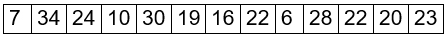{width="3.1041655730533684in"
> height="0.27022856517935256in"}

3.  On peut enfin convertir chacun de ces nombres en lettres de
    l'alphabet (les nombres supérieurs à 26 sont au préalable diminués
    de 26 : 34 devient 8, 28 devient 2, etc.)

> On obtient alors :
>
> 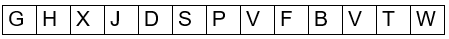{width="3.121525590551181in"
> height="0.27113517060367454in"}
>
> Le mot BOUILLABAISSE est maintenant chiffré en GHXJDSPVFBVTW. Il
> suffirait d'effectuer la démarche inverse pour le retrouver.

Remarques :

- Contrairement au chiffrement par substitution simple, un même élément
  peut se déchiffrer différemment selon la [position]{.underline} qu'il
  occupe dans le texte chiffré. Par exemple, dans le texte chiffré
  GHXJDSPVFBVTW, la lettre V apparaît deux fois : une fois pour
  représenter la lettre B et une autre fois pour la lettre S. C'est
  pourquoi ce chiffrement est appelé « Substitution par position »

- Certains chiffrements Vigenères, au lieu d'effectuer une *addition*
  des rangs des lettres dans chaque colonne lors de l'étape 2,
  effectuent une soustraction. Le déchiffrement demandera donc
  d'effectuer l'opération opposée, c'est-à-dire une addition (ex : Le
  masque de Nefer -- énigme 31)

- Contrairement au chiffrement par substitution simple, la clé ne peut
  pas être constituée de couleurs ou de symboles, mais d'éléments se
  prêtant aux additions / soustractions (nombres ou lettres par exemple)

Dans les chasses de Max, c'est essentiellement un chiffrement par
substitution simple qui est utilisé, plutôt qu'un chiffrement Vigenère.
Toutefois, dans Le masque de Nefer, le Chiffrement Vigenère apparaît au
moins deux fois.

Un travail préalable doit parfois être réalisé pour obtenir la **clé**,
ou encore le **texte chiffré**. De plus, **la traduction** de la clé
n'est parfois pas immédiate et demande des manipulations avant d'obtenir
le résultat. Enfin, le résultat une fois obtenu doit parfois être
**interprété**...

# Exemples de chiffrements polyalphabétiques dans les chasses de Max

Voici quelques exemples de chiffrements polyalphabétiques conçus par Max
(ou tout au moins validés par lui lorsqu'il n'en était pas l'auteur).

Source : « Les chasses au trésor de Max Valentin 1.37.pdf par Ayrin »

<https://www.lachouette.net/contrib/Airyn/Les_chasses_au_tresor_de_Max_Valentin.pdf>

Légende : Les couleurs suivantes indiquent si la clé, le texte chiffré,
la traduction, et l'interprétation sont directement fournies dans
l'énoncé, ou ont demandé un traitement préalable:

{width="4.4472462817147855in"
height="0.2150109361329834in"}

## Le testament de Florence B (décembre 1996)

  -----------------------------------------------------
  Clé :   Texte       Traduction :   Interprétation :
          chiffré :                  
  ------- ----------- -------------- ------------------

  -----------------------------------------------------

- []{#r1 .anchor}Clé[^1^](#n1) : Rodez, Château-Thierry, Briançon,
  Châtellerault, Mulhouse

> 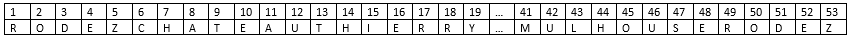{width="6.434722222222222in"
> height="0.29511482939632544in"}

- Texte chiffré : 41, 4, 47, 12, 1, 48, 28, 52, 43, 38 15, 51, 38, 17,
  45, 19

- Traduction : MESURE CELUI DU ROY

## Le trésor d'Orval (mars 1997) -- premier billet 

  ----------------------------------------------------
  Clé :   Texte      Traduction :   Interprétation :
          chiffré  :                
  ------- ---------- -------------- ------------------

  ----------------------------------------------------

- []{#r2 .anchor}Clé[^2^](#n2) :XUEYSELRUOPELBISIVNITSELEITNESSEL

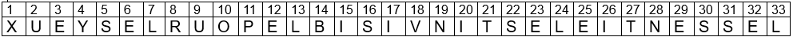{width="5.118055555555555in"
height="0.24375in"}

- Texte chiffré : 11, 10, 2, 8, 21, 23, 30, 4, 6, 9,1, 7, 12, 16, 21,
  23, 30, 21, 24, 10, 2, 3, 5, 21

- Traduction : POUR TES YEUX L'EST EST L'OUEST

## Le trésor d'Orval (mars 1997) -- deuxième billet

  -----------------------------------------------------
  Clé :   Texte       Traduction :   Interprétation :
          chiffré :                  
  ------- ----------- -------------- ------------------

  -----------------------------------------------------

- []{#r3 .anchor}Clé[^3^](#n3) : Boulogne, Compiègne, Moulins, Nantes,
  Quimper, Phare de Cordouan, Puy de Sancy, Laon

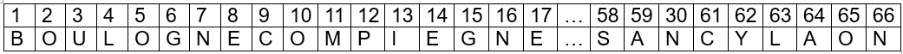{width="5.03296697287839in"
height="0.30440179352580926in"}

- []{#r4 .anchor}Texte chiffré[^4^](#n4) : 35, 47, 8, 66, 43, 58, 4, 57,
  61, 17, 63, 8, 30, 61, 47, 42, 3, 39, 29, 34, 33, 15, 37, 22, 21, 58,
  57, 30, 65, 7, 56, 36, 63, 14, 64, 50, 45, 39, 44, 41, 9, 39, 4, 8,
  58, 43, 29, 30, 9, 57, 25, 56, 24, 36, 28, 20, 58, 63, 51, 58, 44, 61,
  19, 66, 43, 57, 52, 13, 61, 39, 44, 40, 43, 47, 46, 33, 28, 36

- []{#r5 .anchor}Traduction[^5^](#n5) : PRENDS LE CHEMIN DE L'EAU.
  CHERCHE LES GRILLES. DESCENDS ET CREUSE SOUS LA SECONDE NICHE A
  DROITE.

## Une histoire d'histoire (avril 1997)

  -----------------------------------------------------
  Clé :   Texte       Traduction :   Interprétation :
          chiffré :                  
  ------- ----------- -------------- ------------------

  -----------------------------------------------------

- []{#r6 .anchor}Clé[^6^](#n6) :**....\_\...\_ \_ \_ \_\...\_\...\...\_
  \_ \_**

> 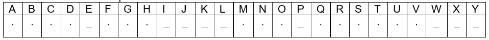{width="4.784722222222222in"
> height="0.3945363079615048in"}

- Texte chiffré : ECOPAVICTORS \* ELUCIDASLACUM \*
  VEAFNUMSCLCAVUELIESURES \* ARAEL \* EX \* FROCE

- Traduction : **\_..\_..\_\.....\*\_
  \_..\_\...\_\....\*.\_\...\....\_\....\_ \_ \_
  \_\...\_.\*...\_\_\*\_\_\*....\_**

- []{#r7 .anchor}Interprétation de la traduction[^7^](#n7) : TERRES
  GASTES RESERVOIR 3M EST

## Le trésor de Malbrouck (novembre 1998) -- énigme 1 

  -----------------------------------------------------
  Clé :   Texte       Traduction :   Interprétation :
          chiffré :                  
  ------- ----------- -------------- ------------------

  -----------------------------------------------------

- Clé : Liste des Argonautes (Mélampous, Héracles, \[...\], Méléagre)

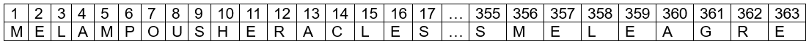{width="5.13859908136483in"
height="0.28478565179352583in"}

- Texte chiffré :
  39-8-F-223-337-9-213-16-6-191-22-79-318-17-4-20-F-12-2-120-27-96-234-14-131-3-297-23-47-124-7-268-185-34-18-112-259-271-163-342.
  Lorsqu'il sera temps, il te faudra aller 54-126-92-203-144

- Traduction : DU FILS DE PELIAS AU FRERE DE CALAIS, TOUS EN ORDRE
  Lorsqu'il sera temps, il te faudra aller A L'EST

- []{#r8 .anchor}Interprétation de la traduction[^8^](#n8) : DU FILS DE
  PELIAS AU FRERE DE CALAIS, TOUS EN ORDRE Lorsqu'il sera temps, il te
  faudra aller AU SUD

## Victoria (février 2000) -- énigme 5

  -----------------------------------------------------
  Clé :   Texte       Traduction :   Interprétation :
          chiffré :                  
  ------- ----------- -------------- ------------------

  -----------------------------------------------------

- Clé[^9^](#n9) :
  1906-1912-1917-1923-1934-1940-1945-1951-1962-1968-1973-1979-1990-1996

> 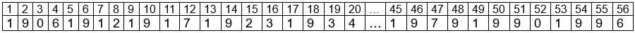{width="5.618055555555555in"
> height="0.2995297462817148in"}

- Texte chiffré :10+12 / 24+5 / 9+14+15+49+36+20 / 24+44 / 32 /
  8+36+43+32

- Traduction :16 / 1 / 19 / 3 / 1 / 12

- []{#r9 .anchor}Interprétation de la traduction[^9^](#n9) : PASCAL

## Victoria (février 2000) -- énigme 7

  -----------------------------------------------------
  Clé :   Texte       Traduction :   Interprétation :
          chiffré :                  
  ------- ----------- -------------- ------------------

  -----------------------------------------------------

- []{#r10 .anchor}Clé[^10^](#n10) : Que j'aime à faire apprendre un
  nombre utile aux sages \[...\]

> 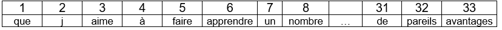{width="4.344444444444444in"
> height="0.26319444444444445in"}

- Texte chiffré : 233, 139, 319, 281, 193, 251, 304, 183, 283, 312, 232,
  158, 261, 133, 114, 197, 126, 67, 213, 103, 111, 304, 201, 181, 231,
  305,85, 153, 192, 128, 157, 133, 305, 263, 11, 193, 275, 262, 162,
  241, 156, 82, 143, 319.32, 94, 198, 147, 142, 194, 312, 127, 221, 202,
  212, 101, 233, 131, 231, 305, 128, 275, 278, 66, 302, 204, 222, 94,
  196, 138, 235, 81, 211, 69, 303, 115, 273, 152, 263, 141, 113, 234,
  161, 282, 151, 316, 51, 253, 103, 154, 308, 311, 133, 221, 31, 236,
  92, 318, 291, 102, 214, 252, 233, 34, 135, 94.171, 313, 197, 111, 94,
  86, 155, 32, 317, 123, 292, 134, 203, 163, 315, 72, 231, 41, 12, 126,
  312, 53, 152, 317, 146-133, 93, 314, 11, 231, 121, 216, 113, 243, 221,
  13, 145, 144, 159, 153, 306, 124, 71, 63, 253, 182, 198, 307

- []{#r11 .anchor}Traduction[^11^](#n11) : LE SEGMENT VAUT CENT DIX SEPT
  VIRGULE CINQ GLOUPIOTS. IL TE REVELERA LA VILLE NATALE D'UN PERSONNAGE
  QUI A FIXE LA CLARTE DU SOLEIL. DANS L'ENIGME HUIT, N VAUT VINGT CINQ
  VIRGULE SIX GLOUPIOTS

- Interprétation de la traduction : Nicéphore Niepce

## Victoria (février 2000) -- énigme 9

  -----------------------------------------------------
  Clé :   Texte       Traduction :   Interprétation :
          chiffré :                  
  ------- ----------- -------------- ------------------

  -----------------------------------------------------

- []{#r12 .anchor}Clé[^12^](#n12) : Zuben Elschernali, Zuben Elgenubi;
  Brachium, Zuben Elakrab

> {width="5.99201334208224in"
> height="0.2753827646544182in"}

- []{#r13 .anchor}Texte chiffré[^13^](#n13) : 39-31-27-34-20-8-45-15

- Traduction : BABINSKI

## Le masque de Nefer (avril 2001) -- énigme 25

  -----------------------------------------------------
  Clé :   Texte       Traduction :   Interprétation :
          chiffré :                  
  ------- ----------- -------------- ------------------

  -----------------------------------------------------

- []{#r14 .anchor}Clé[^14^](#n14) :Tennesse

> 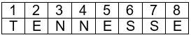{width="1.604430227471566in"
> height="0.2990179352580927in"}

- Texte chiffré : 5+9, 7-14, 1+4, 2+15, 3+5, 4+6, 8+10, 6-3, 1-12, 7-4,
  3-1, 3-9, 7+1, 1-5, 2+18, 6-5, 3+1, 4-8, 2+3, 6-14, 6+4, 7-11, 6-4,
  2+13, 4+1, 4-13, 3+4, 4-9, 7-15, 1-11, 8+9, 3+6, 6-14, 8-1, 7-18,
  5+13, 5+6

- []{#r15 .anchor}Traduction[^15^](#n15) : NEXT STOP HOME TOWN OF THE
  WHO ROARED IN THE DARK

- []{#r16 .anchor}Interprétation de la traduction[^16^](#n16) : MEMPHIS

## Le masque de Nefer (avril 2001) -- énigme 28

  -----------------------------------------------------
  Clé :   Texte       Traduction :   Interprétation :
          chiffré :                  
  ------- ----------- -------------- ------------------

  -----------------------------------------------------

- Clé : Liste de villes (Buenos Aires, London, Berlin, Quebec, Midway,
  Paris, Tivoli, Detroit, Las Vegas, Toronto, Odessa, Oxford, Cambridge,
  Cardiff, San Marcos, Miami, Washington, Calgary, Heidelberg, Rugby,
  Freeport, Cadie, Milano, San Francisco, Praha, Kildare, Hereford,
  Atlanta, Dublin, Las Palmas, Manchester, Aberdeen)

> 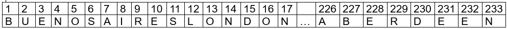{width="5.906944444444444in"
> height="0.34444444444444444in"}

- Texte chiffré : « 174, 139, 41, 150, 177, 3, 30, 8, 233, 68,
  9,15,185, 38. Starting from the place you have reached in riddle #27,
  137, 161, 17, 148, 92, 67, 186, 26, 226, 209, 41 as far as
  possible.*»*

- Traduction : PUT THEM IN ORDER. Starting from the place you have
  reached in riddle #27, GO NORTH-EAST

- []{#r17 .anchor}Interprétation de la
  traduction^[17](#n17),\ [18](#n18)^ : LOS ANGELES

## Le masque de Nefer (avril 2001) -- énigme 31

  -----------------------------------------------------
  Clé :   Texte       Traduction :   Interprétation :
          chiffré :                  
  ------- ----------- -------------- ------------------

  -----------------------------------------------------

- []{#r19 .anchor}Clé de Vigenère[^19^](#n19) : KANTUTA

- []{#r20 .anchor}Texte chiffré[^20^](#n20) : H, N, P, O, T, G, K, J, L,
  U, T, N, U, S, G, D, E, V, F, X,D, C, S, Q, Y, N, Y, E, D, R, R, U, W,
  U, N, M, H, S, K, S, U, B, J, Z, F, X, T, V, Z, G, D, Z, Z, J, Y, H,
  H, C, A, Y, U, G, Q, T, M, F, K, X, O, R, D, W, U, M, J, T, N, W, H,
  P, X, T, M, D, C, N, B, G, W, K, M, I, D, E, O, X, I, T, P, S, D, U.

- []{#r21 .anchor}Traduction[^21^](#n21) : SODIO ALUMINIO TRES
  PARENTESIS FOSFORO OXIGENO CUATRO PARENTESIS DOS PARENTESIS OXIGENO
  HIDROGENO PARENTESIS CUATRO

<!-- -->

- Interprétation de la traduction : NaAl3(PO4)2(OH)4 est la formule de
  la BRAZILIANITE

## Le masque de Nefer (avril 2001) -- énigme 45

  ----------------------------------------------------
  Clé :   Texte      Traduction :   Interprétation :
          crypté :                  
  ------- ---------- -------------- ------------------

  ----------------------------------------------------

- []{#r22 .anchor}Clé[^22^](#n22) : Les premières lignes du livre XII de
  l'Enéide

> 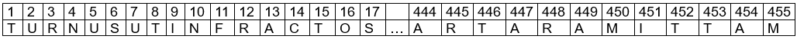{width="6.031944444444444in"
> height="0.30486111111111114in"}

- Texte crypté : 147. 7. 96. \* 58. 24. 6. 1. 60., \* 68. 191. 92. 93.
  \* 13. 25. 61. 9. 12. 31.3. 21.
  \* 124. 33. 77. 115. 81. 110. 146. 121. \* 188. 163. \* 8. 10. 5. 23.
  1.\* 18. 3. 9. 22. 5. 26. 20., \* 17. 231. 125. 95. 22. 101. 80. 280.
  \* 104. 32.160. 198. 130. 155.
  \* 127. 189. 106. 302. 35. 4. 201. 314. 272. 103. \*
  19.\* 22. 1. 14. 5. 16. 26. 4. \* 17. 14. \* 8. 24. 19. 15. 5. 6.,
  \* 100. 65. 30. 138.143. 27. 203. \* 19. 1. \* 7. 16. 2. 19. 7.
  \* 19. 19. 7. 25. 10. \* 12. 7. 19. \*24. 14. 19. 6. 20.,
  \* 206. 230. 140. 406. 472. 128. 132. 105. 240. 40. \* 42.156.
  \* 4. 22. 1. 14. \* 21. 16. 6. 22. 6. 6. 13., \* 358. 277.
  \* 5. 19. 24. 2.23. 1. 3. 3. \* 26. \* 22. 17.
  \* 6. 10. 6. 22. 20. 26. 11. \* 19. 19. 17. 22.
  \*25. 10. 4. 10. 22. 5. 10. \* 4. 16.
  \* 17. 22. 3. 14. 12. 16. 26. 26. \* 17. 14.\* 9. 10. 19. 14. 7.'
  \* 14. 11. 4. 26. 22. \* 16. 14. 7. \* 18. 22. 26. \* 16.
  10.10. 18. 22. 4. \* 17. 6. \* 50. 149. 10. 109. 131.
  \* 117. 129. 200. 261. 113. \*6. 4. 2. \* 26.
  \* 25. 20. 6. 9. 15. 9. 2. \* 135. 5. 158. 51. 15. 173. \*
  166.278. 134. 120. 254. 16. \* 169. 264.
  \* 11. 204. 91. 142. 123. 144. 429. \* 257. 157.
  \* 151. 194. 402. 116. 14. 209.

- []{#r23 .anchor}Traduction[^23^](#n23) : SUL POSTO, PUOI AMMIRARE
  MIGLIAIA DI TNUST ARIRUAU, SCOPRIRE STRANI PERSONNAGI D RTCUOAN SC
  TODTUS, BALLARE DT UOUDU DDUMN RUD OCDSU, ASSAPORARE IL NRTC EOSRSSA,
  IL UDOUSTRR A RS SNSRUAF. DDSR MNNNRUN NO SRRCROAA SC INDCU' CFNAR.
  OCU ARA ONNAR SS TANTO TEMPO SNU A MUSITIU. QUESTO NUMERO TI FORNIRA
  IL CODICE.

- Interprétation de la traduction : CAGLIARI

# Informations complémentaires

**Le testament de Florence B (décembre 1996)**

- [⭡](#r1)Note 1 : Il fallait relier les 5 villes (Rodez, Château
  Thierry, Briançon, Châtellerault, Mulhouse) selon une ligne brisée
  représentant une étoile à 5 branches et les ranger dans l'ordre du
  tracé afin d'obtenir une clé qui fonctionne.

**Le trésor d'Orval (mars 1997) -- premier billet**

- [⭡](#r2)Note 2 : La clé était difficile à trouver parce que la phrase
  « L'essentiel est invisible pour les yeux » se trouvait incognito dans
  la partie narrative du livre, et n'était pas mentionnée comme faisant
  partie des outils de décryptage. Par ailleurs, il fallait écrire cette
  phrase de droite à gauche pour construire la grille de correspondance.

**Le trésor d'Orval (mars 1997) -- deuxième billet**

- [⭡](#r3)Note 3 : A l'aide de la phrase « Utilise ton expérience. Sois
  alphabétique pour les cinq de tête, chronologique ensuite », il
  fallait déduire qu'il s'agissait de réunir les noms des lieux
  rencontrés jusqu'alors : les 5 premiers par ordre alphabétique
  (Boulogne, Compiègne, Moulins, Nantes et Quimper), et les trois
  derniers par ordre chronologique (Phare de Cordouan, Puy de Sancy et
  Laon). Les 5 premiers n'avaient pas été rencontrés nommément, mais ils
  avaient pu servir à la construction du triangle englobant les villes
  du périple de François 1^er^.

- [⭡](#r4)Note 4 : Le texte crypté n'était pas fourni tel qu'indiqué
  ci-dessus, car chaque nombre avait été augmenté de 7 unités (42, 54,
  15, etc.). Cela était précisé assez clairement dans le texte de
  l'énigme malgré une confusion possible entre 7 et 8, mais une IS
  précisait que « 7 est mieux que 8 ».

- [⭡](#r5)Note 5 : Comme l'a démontré
  [MarvinClay](https://marvinclay.blogspot.com/2021/10/court-circuiter-la-chasse.html),
  il était possible de décoder la clé par tâtonnements en connaissant
  seulement les 5 premiers lieux (mais pas les 3 derniers).

**Une histoire d'histoire (avril 1997)**

- [⭡](#r6)Note 6 : La clé s'obtenait en additionnant toutes les années
  trouvées dans l'étape précédente. Le livre d'Ayrin ne précise pas si
  l'énigme comportait un indice suggérant d'effectuer une telle
  addition, ou s'il fallait simplement en avoir l'inspiration... On
  trouvait alors 43762 qui s'écrit en morse comme indiqué dans la grille
  de correspondance ci-dessus (.... -- \... -- -- etc.)

- [⭡](#r7)Note 7 : Bien que le texte chiffré comporte des astérisques
  pour marquer la séparation entre les mots, il demeurait ardu
  d'interpréter la suite de signes morse (à titre d'exemple, le premier
  mot « \_**..\_..\_\..... »** peut se découper en lettres de 1490
  façons différentes). Heureusement, une IS fournissait le patron de
  découpage : 1, 1, 3, 3, 1, 3 \* 3, 2, 3, 1, 1, 3, \* 3, 1, 3, 1, 3, 4,
  3, 2, 3 \* 5 \* 2 \* 1, 3, 1

**Le trésor de Malbrouck (novembre 1998) -- énigme 1**

- [⭡](#r8)Note 8: La première partie de la traduction suggérait de
  ranger les noms par ordre alphabétique (« du fils de Pélias au frère
  de Calais » signifie « de Acaste à Zetes »). Il fallait alors créer
  une deuxième grille de correspondance respectant cette consigne, et
  comprendre que seule cette deuxième grille permettait de décoder la
  fin de la clé (54-126-92-203-144), qui donnait alors « AU SUD » et non
  plus « A L'EST ». Il s'agit là d'un surcodage puisqu'un premier
  décodage fournit une information pour un second décodage du même
  texte.

**Victoria (février 2000) -- énigme 5**

- [⭡](#r9)Note 9 : Il fallait assembler toutes années du 20^ème^ siècle
  commençant un lundi, sachant que le lundi 1^er^ janvier 1900 était
  précisément un lundi. Le piège était que l'année 1900 n'appartient pas
  au 20^ème^ siècle (c'est la dernière année du 19^ème^). Les chercheurs
  qui tombaient dans ce piège et construisaient une grille de
  correspondance qui démarrait en 1900 aboutissaient à un autre
  résultat : KEPLER

**Victoria (février 2000) -- énigme 7**

- [⭡](#r10)Note 10 : Un texte assez alambiqué permettait de comprendre
  qu'il fallait tracer un cercle, et donc d'utiliser le nombre Pi. Il
  fallait alors penser à utiliser la célèbre phrase mnémotechnique « Que
  j'aime à faire apprendre un nombre utile aux sages etc. »

- [⭡](#r11)Note 11 : La difficulté de la traduction tenait dans
  l'utilisation particulière qu'il fallait faire des nombres de la clé :
  233 signifiait « 23^ème^ mot, 3^ème^ lettre », 94 signifiait « 9^ème^
  mot, 4^ème^ lettre, etc.

**Victoria (février 2000) -- énigme 9**

- [⭡](#r12)Note 12 : Une balance Roberval devait faire penser à la
  constellation de la balance et ses 4 étoiles principales (Zuben
  Elschernali, Zuben Elgenubi, Brachium et Zuben Elakrab) . Deux indices
  complémentaires étaient fournis : la phrase « il faudrait être fou
  pour lutter contre elles » censée renvoyer à une citation de Charles
  Perrault évoquant les étoiles, et des petits symboles étoilés
  dispersés dans une grille.

- [⭡](#r13)Note 13 : Le texte chiffré était donné sous forme graphique :
  un tableau de 4 lignes correspondant aux 4 étoiles, repérées par une
  petite flèche au début de chaque ligne. Une ligne brisée sur le
  tableau, dont certaines cases colorées en noir devaient être ignorées,
  fournissait la solution BABINSKI

> 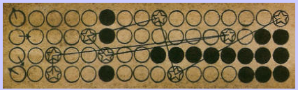{width="1.9201388888888888in"
> height="0.5840277777777778in"}

**Le masque de Nefer (avril 2001) -- énigme 25**

- [⭡](#r14)Note 14 : La clé découlait de l'image suivante, représentant
  des horaires dont il fallait relever la ou les premières lettres des
  horaires en anglais 😬

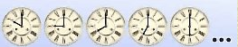

- [⭡](#r15)Note 15 : Le texte chiffré comportait des opérations
  arithmétiques qui devaient être utilisées de la façon suivante :

  - le premier nombre devait être traduit directement via la grille de
    correspondance

  - le deuxième nombre représentait un décalage dans l'alphabet

  - ex : 5+9 signifie « prendre la 5^ème^ lettre de la grille de
    correspondance (c'est-à-dire le E) puis la décaler de 9 rangs dans
    l'alphabet ». On tombe sur la lettre N.

- [⭡](#r16)Note 16 : Le zoo où vivait le lion du générique des films de
  la Metro Goldwyn Mayer se trouve à Memphis

**Le masque de Nefer (avril 2001) -- énigme 28**

- [⭡](#r17)Note 17 : La première partie de la traduction suggérait de
  ranger les noms par ordre alphabétique (comme dans le Trésor de
  Malbrouck). Il fallait alors créer une deuxième grille de
  correspondance respectant cette consigne, et comprendre que seule
  cette deuxième grille permettait de décoder la fin de la clé (137,
  161, 17, 148, 92, 67, 186, 26, 226, 209, 41), qui donnait alors
  « TSEWHTUOSOG » qui se lit de droite à gauche « GO SOUTH-WEST ». Il
  s'agit là d'un surcodage puisqu'un premier décodage fournit une
  information pour un second décodage du même texte.

> []{#n18 .anchor}

- [⭡](#r17)Note 18 : Pour déduire que la solution était LOS ANGELES, il
  fallait remarquer que l'endroit où le chercheur se trouvait à ce
  moment (Adrian, Texas) était équidistant de Chicago et de Los-Angeles.
  Chicago se trouvait au nord-est, et Los Angeles au sud-ouest. Dès
  lors, « as far as possible » devait être interprété comme un choix à
  faire entre ces deux villes.

**Le masque de Nefer (avril 2001) -- énigme 31**

- [⭡](#r19){width="0.9847222222222223in"
  height="0.6416666666666667in"}Note 19 : L'énigme précédente avait plus
  ou moins suggéré d'aller en Bolivie. Or Le visuel du mur faisait
  apparaître au premier plan la fleur-symbole de la nation bolivienne :
  la kantuta. Le chercheur était alors censé comprendre qu'il s'agissait
  de la clé de décryptage.

> {width="0.8958333333333334in"
> height="0.8680555555555556in"}

- [⭡](#r20)Note 20 : Le texte chiffré n'était pas fourni directement. Il
  fallait le construire en suivant les étapes suivantes :

  - 26 briques de formes différentes, empilées en un mur, suggéraient de
    leur associer les 26 lettres de l'alphabet. Pour cela, il fallait
    partir de la brique en bas à gauche et terminer en haut à droite. 😬

  - Le chercheur était dès lors en mesure de créer la table de
    correspondance suivante :

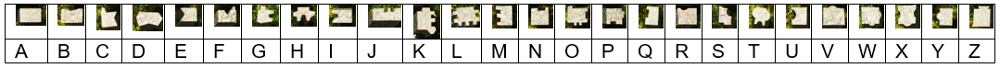{width="5.816666666666666in"
height="0.39904090113735785in"}

- Par ailleurs, un ensemble de briques étalées sur le sol avaient des
  formes qui rappelaient les 26 briques du mur.

{width="2.9097222222222223in"
height="1.776492782152231in"}

- Le chercheur avait alors en mains le texte à déchiffrer vu plus haut
  (H, N, P, O, T, G, etc.)

<!-- -->

- [⭡](#r21)Note 21 : Le chercheur pouvait alors mettre en place un
  déchiffrement de Vigenère en superposant le texte chiffré et la clé
  KANTUKA (répétée autant de fois que nécessaire),

> 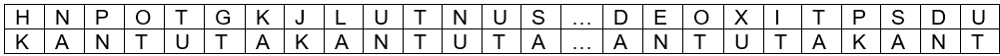{width="6.585141076115486in"
> height="0.375in"}
>
> Il s'agissait ensuite d'ajouter les rangs alphabétiques des lettres de
> chaque colonne
>
> H + K = 8 + 11 = 19 = S
>
> N + A = 14 + 1 = 15 = O
>
> P + N = 16 + 14 = 30. On retire 26 *: 30 -- 26 = 4 = D*
>
> Etc.

**Le masque de Nefer (avril 2001) -- énigme 45**

- [⭡](#r22)Note 22: Différents éléments du visuel étaient censés
  suggérer le livre XII de l'Enéide : un texte en italiques, deux
  anneaux entrelacés (fusion entre latins et troyens), 12 livres
  numérotés, et la musique « La belle hélène » d'Offenbach.

{width="1.4017300962379702in"
height="1.3652777777777778in"}

> La grille de correspondance se construisait à partir des premières
> strophes du livre XII de l'Enéide :
>
> Turnus ut infractos aduerso Marte Latinos
>
> \[...\]
>
> Aut hac Dardanium dextra sub Tartara mittam,

- [⭡](#r23)Note 23 : La traduction de premier niveau fournissait
  certains mots en italien, et d'autres mots dénués de sens (en rouge
  ci-dessous) :

> SUL POSTO, PUOI AMMIRARE MIGLIAIA DI TNUST ARIRUAU, SCOPRIRE STRANI
> PERSONNAGI D RTCUOAN SC TODTUS, BALLARE DT UOUDU DDUMN RUD OCDSU,
> ASSAPORARE IL NRTC EOSRSSA, IL UDOUSTRR A RS SNSRUAF. DDSR MNNNRUN NO
> SRRCROAA SC INDCU' CFNAR. OCU ARA ONNAR SS TANTO TEMPO SNU A MUSITIU.
> QUESTU NUMERO TI FORNIRA IL CODICE.
>
> La dernière partie de cette traduction signifiait : « Ce numéro te
> fournira le code »
>
> Il fallait alors comprendre que c'est le mot « NUMERO » lui-même qui
> devait être utilisé pour décoder correctement les mots
> incompréhensibles.
>
> Le chercheur pouvait alors mettre en place un déchiffrement de
> Vigenère en assemblant les blocs dénués de sens et en les superposant
> à la clé NUMERO (répétée autant de fois que nécessaire).
>
> 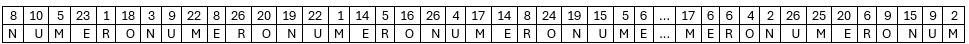{width="6.520833333333333in"
> height="0.2959481627296588in"}
>
> Il s'agissait alors d'effectuer un déchiffrage Vigenère, c'est-à-dire
> de soustraire le rang alphabétique des lettres de la deuxième ligne
> aux nombres de la première ligne.
>
> 8 -- N = 8 -- 14 = -- 6. On ajoute 26 : -- 6 + 26 = 20 = T
>
> 10 -- U = 10 -- 21 = -- 11. On ajoute 26 : -- 11 + 26 = 15 = O
>
> 5 -- M = 5 -- 13 = -- 8. On ajoute 26 : -- 8 + 26 = 16 = R
>
> Etc.
>
> Le texte final donnait ensuite : «Sul posto, puoi ammirare migliaia di
> torri coniche, scoprire strani personnagi e animali di pietra, ballare
> al suono delle tre canne, assaporare il pani carasau, il pecorino e il
> Nuragus. Devi trovare la capitale di quest' isola. Ciò che cerchi da
> tanto tempo non è lontano. Questu numero ti fornirà il codice.»
>
> Traduction : Sur place, tu peux admirer des milliers de tours
> coniques, découvrir d'étranges personnages et animaux en pierre,
> danser au son de trois tubes de roseaux, te régaler de « pani
> carasau », de « pecorino » et de « Noragus ». Tu dois trouver la
> capitale de cette île. Ce que tu cherches depuis si longtemps n'est
> pas loin. Ce numéro te fournira le code.
